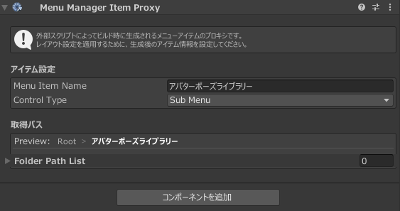
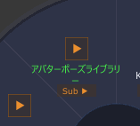
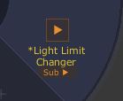
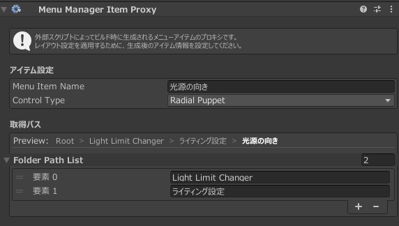
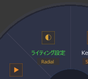

# ManuManagerItemProxy

## 概要

`ManuManagerItemProxy` コンポーネントは、MAを使用せず、ビルド時にメニューを生成するような外部スクリプト由来のメニューを制御するコンポーネントです。また、自動生成メニューで中身が見えないアスタリスク付きのメニューの中のアイテムを取り出す際にも使用できます。

### 設定項目

| 項目 | 説明 |
|------|------|
| **Menu Item Name** | 制御するメニューアイテム名。該当のメニューと完全に一致し、メニュー内で一意である必要があります。 |
| **Control Type** | 制御するメニューアイテムのタイプ |
| Preview | 下記パス設定をしたときのプレビュー表示 |
| **Folder Path List** | 自動生成メニューやスクリプト制御のメニューの中身を制御したい場合、ここで親のパスを指定する |

## Folder path Listの使い方

### ビルド時生成メニューの制御

アバターポーズライブラリーを例とします。 
空のオブジェクトに`Menu Manager Item Proxy`を追加し、Menu Item Nameにアバターポーズライブラリーで設定したメニュー名と同様の名前を設定します。

設定が完了しMenu Managerをリロードすると緑色のメニューが追加されます。これがアバターポーズライブラリーと同期しているため、他アイテムと同様に制御が可能です。

## 動的メニューの内部アイテムの制御

Light Limit ChangerやVirtual Lens 2などは動的メニューとしてメニュー内部の制御ができません。

::: info 💾 アスタリスク付きのメニュー
アスタリスク付きのメニューはスクリプトによって動的に生成されるメニューです。([詳細](/guide/explanation))
:::

この場合、内部アイテムで制御したいアイテムを親パスを用いて制御します。
例えば、LightLimitChangerの内部、`LightLimitChanger`>`ライティング設定`>`光源の向き`というラジアルメニューのメニュー位置を変更したい時は以下画像のように設定します。

この際、例えば既にMenu Manager上でLight Limit Changerの階層を`Root`>`Tools`>`Light Limit Changer`のように変更していたとしてもFolder Path Listでは`Root`>`Light Limit Changer`と設定します。

::: info 💾 詳細
このコンポーネントはアセットの初期配置を基準に制御するため、動的生成メニューが未編集状態で追加されるRootを基準とします。
:::

設定が完了すると、同様に緑色のプロキシメニューが追加されます。

::: warning ⚠️ 注意
空のオブジェクトでなく、該当スクリプトがついているオブジェクトにコンポーネントをアタッチしても機能する場合がありますが、スクリプトの挙動によっては干渉してしまう恐れがあるため、基本的には空のオブジェクトで管理するのが望ましいです。
:::
